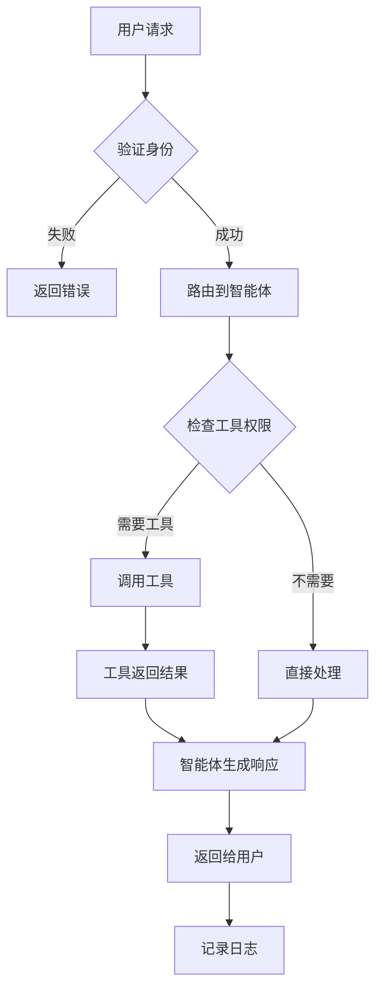

# AI中控平台 - 流程图

## 1. 智能体创建流程

```
开始
  |
  v
[用户登录系统]
  |
  v
[进入智能体管理页面]
  |
  v
[点击"创建智能体"按钮]
  |
  v
[填写智能体信息]
  |-- 名称
  |-- 描述
  |-- 选择模型
  |-- 配置参数
  |
  v
[系统验证输入]
  |
  +-----> [验证失败] -----> [提示错误信息] -----> [返回修改]
  |
  v
[验证成功]
  |
  v
[调用API创建智能体]
  |
  v
[保存智能体配置到数据库]
  |
  v
[返回创建结果]
  |
  v
[显示智能体详情页面]
  |
  v
结束
```

## 2. API调用流程

```
开始
  |
  v
[客户端发起API请求]
  |
  v
[网关接收请求]
  |
  v
[验证API密钥]
  |
  +-----> [验证失败] -----> [返回401错误]
  |
  v
[验证成功]
  |
  v
[检查调用频率限制]
  |
  +-----> [超出限制] -----> [返回429错误]
  |
  v
[频率正常]
  |
  v
[路由到对应智能体]
  |
  v
[智能体处理请求]
  |
  v
[调用相关工具(如果需要)]
  |
  v
[生成响应结果]
  |
  v
[返回结果给客户端]
  |
  v
[记录调用日志]
  |
  v
结束
```

## 3. 工具管理流程

```
开始
  |
  v
[管理员进入工具管理页面]
  |
  v
[选择操作类型]
  |
  +-----> [添加工具]
  |        |
  |        v
  |      [填写工具信息]
  |        |-- 工具名称
  |        |-- 工具类型
  |        |-- API配置
  |        |-- 权限设置
  |        |
  |        v
  |      [验证配置]
  |        |
  |        +-----> [验证失败] -----> [提示错误]
  |        |
  |        v
  |      [保存工具配置]
  |        |
  |        v
  |      [工具上线]
  |
  +-----> [编辑工具]
  |        |
  |        v
  |      [选择要编辑的工具]
  |        |
  |        v
  |      [修改配置]
  |        |
  |        v
  |      [保存更改]
  |
  +-----> [删除工具]
           |
           v
         [确认删除]
           |
           v
         [移除工具]
           |
           v
         [更新关联智能体]
```

## 4. 权限控制流程

```
开始
  |
  v
[用户发起操作请求]
  |
  v
[系统识别用户角色]
  |
  v
[检查角色权限]
  |
  +-----> [有权限] -----> [执行操作] -----> [记录操作日志]
  |
  v
[无权限]
  |
  v
[返回权限不足错误]
  |
  v
结束
```

## 5. 监控告警流程

```
开始
  |
  v
[定时采集监控数据]
  |
  v
[分析监控指标]
  |
  +-----> [指标正常] -----> [更新仪表盘]
  |
  v
[指标异常]
  |
  v
[触发告警规则]
  |
  v
[发送告警通知]
  |-- 邮件通知
  |-- 短信通知
  |-- 系统内通知
  |
  v
[记录告警事件]
  |
  v
[等待人工处理]
  |
  v
[问题解决]
  |
  v
[关闭告警]
  |
  v
结束
```

## 6. 智能体调用流程图(Mermaid格式)



## 7. 系统架构图

```
┌─────────────────────────────────────────────────────────────┐
│                      用户界面层                               │
│  ┌──────────┐  ┌──────────┐  ──────────┐  ┌──────────┐    │
│  │ Web控制台 │  │ 移动APP  │  │  API文档  │  │ 监控大屏 │    │
│  └──────────┘  └──────────┘  └──────────  └──────────┘    │
─────────────────────────────────────────────────────────────┘
                              │
┌─────────────────────────────────────────────────────────────┐
│                      API网关层                                │
│  ┌──────────────────────────────────────────────────────┐   │
│  │              认证/限流/路由/日志                        │   │
│  └──────────────────────────────────────────────────────┘   │
└─────────────────────────────────────────────────────────────┘
                              │
┌─────────────────────────────────────────────────────────────┐
│                      业务逻辑层                               │
│  ┌──────────┐  ┌──────────┐  ┌──────────┐  ┌──────────┐    │
│  │智能体管理 │  │工具管理  │  │权限管理  │  │监控告警  │    │
│  └──────────┘  └──────────┘  └──────────┘  └──────────┘    │
└─────────────────────────────────────────────────────────────┘
                              │
┌─────────────────────────────────────────────────────────────┐
│                      数据层                                   │
│  ┌──────────┐  ┌──────────  ┌──────────┐  ┌──────────┐    │
│  │  MySQL   │  │  Redis   │  │  MongoDB │  │  日志系统 │    │
│  └──────────┘  └──────────┘  └──────────  └──────────┘    │
─────────────────────────────────────────────────────────────┘
                              │
┌─────────────────────────────────────────────────────────────┐
│                      外部服务层                               │
│  ┌──────────┐  ┌──────────┐  ┌──────────┐  ┌──────────┐    │
│  │ OpenAI   │  │  Dify    │  │  Coze    │  │ 其他AI服务│    │
│  └──────────┘  └──────────┘  └──────────  └──────────┘    │
─────────────────────────────────────────────────────────────┘
```